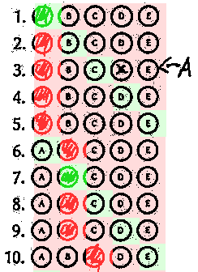

# autograder

## Automatically grade MCQ exams using optical mark recognition

`autograder` allows you to automatically grade MCQ exams. It is written in pure
rust and runs both in the command line and the modern web browsers using wasm.

## High level idea

You have a lot of bubble sheets like this:

You want them automatically graded. `autograder` will transform those bubble
sheet into image reports like this:

together with a CSV file with an entry like this:

| **Filename**                                      | **ID** | **Total Score** | **Version** | **Q001** | **Q002** | ... | **Q100** |
|---------------------------------------------------|--------|-----------------|-------------|----------|----------|-----|----------|
| ...                                               | ...    | ...             | ...         | ...      | ...      | ... |          |
| GRADE_BY_HAND-20120-v1-score5-DOC010725-page2.png | 20120  | 5               | 1           | 0        | 1        | ... |          |
| ...                                               | ...    | ...             | ...         | ...      | ...      | ... | ...      |

## Preparation
### Installation

`cargo run help` and `trunk serve` should work just fine. You can see a demo on
[GitHub pages](https://o-tho.github.io/autograder/). Note that all computations
are done within the browser and no sensitive files will be transmitted anywhere.

### The template

We need a template which tells us where every answer box is located on the page
and where three large round circles on the page are to identify the position of
a scan.

Navigate to the *Create Form* view and adjust the settings. This generates a PDF
file to print (in A4) and the corresponding `template.json` file that you need
to provide when you grade the exam. Do **not** lose the `template.json` file: It
precisely encodes where each bubble is located and is necessary later on.

### The exam key

Go to *Create Key*. Enter how many versions you have and enter the correct
answers. You can then download the key as `key.json`

Most of the time a key will look like this: `ABCDEABCDE`, which means the
correct answer to Q1 is A, to Q2 is B etc. However, potentially more than one
answer is correct. If for example in question 2, a student can choose either B
or E, then `A(BE)CDEABCDE` would allow for either answer in question 2.

`autograder` does not support different weighting for different questions.
However, the CSV file **does** include information about which questions were
answered correctly and which were answered incorrectly, so you can account for
unequal weighting afterwards manually.

## Grading Exams

Please scan to grayscale (and not to "black and white" or binary), because many
scanners use bad algorithms for the conversion to pure black and white. A
resolution of 150dpi works very well. We recommend that you scan to a multi-page
PDF file, which contains one scan per page. Occasionally scanners produce faulty
image files. In that case `autograder` will complain and some image reports will
just include error messages.

In the *Generate Report* view you can upload a `template.json`, a `key.json` and
an image container (like a multi-page tiff, a PDF, or a single image).

Once you have uploaded them, you see a button to *Do the thing*. This might take
a moment -- and because the browser has only access to a single thread, updates
in the UI might take a while. Scans are processed in batches of 20, occasionally
triggering an update in the view. You can always look into the developer
console, which has a rather verbose output to what is happening in the
background.

Afterwards you can download a zip file containing a CSV file with all the
results and conveniently named image reports. Let's discuss excerpts from image
reports:

This report is the easiest to understand. First of all, the background colour
indicates whether an answer is correct or incorrect with respect to the provided
key, so for example the correct answer to Q6 is A and all other answers are
incorrect. The foreground indicates whether `autograder` detected a student
selection, so from the bright green and bright red we see that the student
selected AAAAABB. All answers are incorrect except for Q1 and Q7. `autograder`
awards two points for these questions to the student in total.

Let's look at the second excerpt:

Here we also see an orange background. This means that `autograder` was not
completely sure how to grade the answers. `autograder` only awards points when
it is sure that the student selected the correct answer and gives you the
responsibility to deal with ambiguous cases. In Q56 the student selected two
answers. Potentially one was by mistake. If you want, you can manually increase
the score by 1 if you think that the student deserves a point for Q56. This is
up to you.

In the corresponding CSV file, you will see this:

| **Filename** | ... | **Q054** | **Q055** | **Q056** | **Q057** | ... |
|--------------|-----|----------|----------|----------|----------|-----|
| ...          | ... | 1        | 0        |          | 0        | ...    |

Note that the entry for Q56 is blank to further indicate that `autograder` could
not completely interpret the answer.

Now consider this excerpt:

Here `autograder` is certain about the grading: if a bubble is significantly
more black than all the other ones, so `autograder` interpreted the student
selecting A in Q3 and did not flag this for manual grading.

If you uploaded multiple bubble sheets bundled into one PDF file called
`DOC010725.pdf`, then the zip file you download from the web
interface will be called `DOC010725.zip` and contains
`DOC010725.csv`, which stores the following data as discussed:

| **Filename**                                      | **ID** | **Total Score** | **Version** | **Q001** | **Q002** | ... | **Q100** |
|---------------------------------------------------|--------|-----------------|-------------|----------|----------|-----|----------|
| ...                                               | ...    | ...             | ...         | ...      | ...      | ... |          |
| GRADE_BY_HAND-20120-v1-score5-DOC010725-page2.png | 20120  | 5               | 1           | 0        | 1        | ... |          |
| ...                                               | ...    | ...             | ...         | ...      | ...      | ... | ...      |

The zip file also contains those image files, which make it easy to see which
files need manual attention. The suffix "pageN" indicated the page in the
original file `DOC010725.pdf` if you want to look at the image
before `autograder`'s processing.

### Using autograder from a mobile device

If you only want to use `autograder` to grade a handful of bubble sheets, you can
do it like this:

First, on a device with a large display, navigate to *Create Magic Link*. Here
you can upload a key and a template and `autograder` generates a _very_ long link.
This link encodes all the template and key data and can be shared with anyone --
most importantly yourself for usage on a mobile device. Bookmark that
very long link with a descriptive name like "Stat101 Test 1" on your mobile device.

If you open the magic link on a mobile device, you will see (if the width of
your screen is less than its height) a simplified interface, where you can
upload individual pictures from your mobile device for instant grading.

Please make sure that the image only shows the (complete) bubble sheet by
cropping.

## History

We have previously used
[FormScanner](https://sites.google.com/site/examgrader/formscanner), but
encountered issues in our use cases: Java tends to be a pain to set up, using
Excel to grade the exams wasn't convenient for us and it was very difficult to
check for mistakes in the individual grading.

As this is work in progress, we chose to be compatible with bubble sheets as
used by form scanner.

## Acknowledgements

This project uses [typst](https://github.com/typst/typst) for typesetting and
ships with copies of the Linux Biolinum font by Philipp H Poll.
