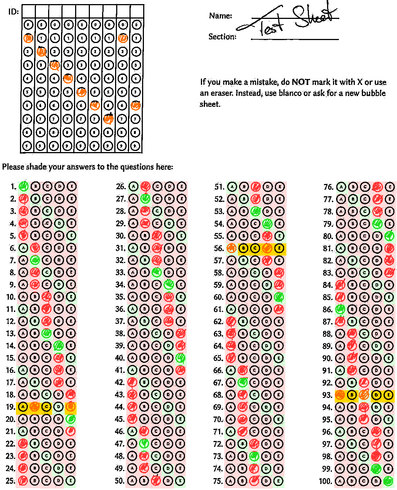

# autograder

## Automatically grade MCQ exams using optical mark recognition

`autograder` allows you to automatically grade MCQ exams. It is written in pure
rust and runs both in the command line and the modern web browsers using wasm.

## Installation

`cargo run help` and `trunk serve` should work just fine. You can see a demo on
[GitHub pages](https://oqpvc.github.io/autograder/). Note that all computations
are done within the browser and no sensitive files will be transmitted anywhere.

## Background

We have previously used
[FormScanner](https://sites.google.com/site/examgrader/formscanner), but
encountered issues in our use cases: Java tends to be a pain to set up, using
Excel to grade the exams wasn't convenient for us and it was very difficult to
check for mistakes in the individual grading.

As this is work in progress, we chose to be compatible with bubble sheets as
used by form scanner.

## High level idea

You have a bubble sheet like this:

You want it automatically graded. `autograder` has a command line interface,
which is self-documented. The following is for the wasm web application.

## Preparation

### The template

We need a template which tells us where every answer box is located on the page
and where three large round circles on the page are to identify the position of
a scan.

You have two options for this. You can either use the *Create Form* view, which
generates a PDF file to print (in A4) and the corresponding `template.json` file
that you need to provide when you grade the exam.

#### Using a custom form

If you want to use a custom form, this is entirely possible, but significantly
more painful.

For this, go to the *Create Template* view. Upload an image file (like .png) of
an empty form, preferably directly converted from a PDF file so nothing is
skewed by a scanner. You need to enter the following information:

- how many questions there are
- how long the student ID is
- how many versions the exam has
- how many answers each question has
- how wide an answer bubble is (in px)
- how high an answer bubble is (in px)
- how much padding there is between the bubbles (in px)
- the top-left corner of the first bubble of  the first question (in px)
- the top-left corner of the first bubble of the version question (in px)
- the top-left corner of the first bubble of the first ID question
- the approximate center of the three big circles (in px)
- the approximate radius of the inner white circle (in px)

You should use an image editor like gimp to find out those coordinates.

After entering this data and uploading an image file, you can hit "Preview" to
see if everything goes well. You can then download the configuration to
`template.json`

If this does not work in your case, you will need to adapt the `template.json`
by hand and provide the coordinates of the bounding boxes of all bubbles (top
left corner and bottom right corner).

### The exam key

Go to *Create Key*. Enter how many versions you have and enter the correct
answers. You can then download the key as `key.json`

At this point every question is graded as one point and only one choice can be
correct.

## Grading Exams

The most reliable way to scan exams is to use *Multipage Grayscale Tiffs*. PDFs
are also supported, but we have encountered issues with Toshiba scanners which
produced invalid JPGs inside the PDF, which we cannot handle. A resolution of
150dpi is sufficient, maybe you can even get away with 100dpi.

Scan to grayscale (and not to "black and white" or binary), because many
scanners use bad algorithms for the conversion to pure black and white.
`autograder` also uses pure black and white internally by converting grayscale
to binary using Kapur's algorithm, which is significantly better than what we
have seen any scanner use. So please, do yourself a favour and scan to
grayscale.

In the *Generate Report* view you can upload a `template.json`, a `key.json` and
an image container (like a multi-page tiff, a PDF, or a single image).

Once you have uploaded them, you see a button to *Do the thing*. This might take
a moment -- and because the browser has only access to a single thread, updates
in the UI might take a while. Scans are processed in batches of 20, occasionally
triggering an update in the view. You can always look into the developer
console, which has a rather verbose output to what is happening in the background.

Afterwards you can download a zip file containing a CSV file with all the
results and conveniently named reports like this:

These image reports were the main motivation to develop this software: using OMR
will always be a bit error-prone, especially when students use the bubble sheet
in ways that is not intended.

A green circle means that `autograder` thinks that the selected bubble is the
circled one, which according to the key is correct. A red circle shows the
correct answer, meaning that the selected bubble is elsewhere. An orange box
indicates that `autograder` was not sure how to understand the choice and that
manual grading is indicated.

### Using autograder from a mobile device

If you only want to use `autograder` to grade a handful of bubble sheets, you can
do it like this:

First, on a device with a large display, navigate to *Create Magic Link*. Here
you can upload a key and a template and `autograder` generates a _very_ long link.
This link encodes all the template and key data and can be shared with anyone --
most importantly yourself for usage on a mobile device. Bookmark that
very long link with a descriptive name like "Stat101 Test 1" on your mobile device

If you open the magic link on a mobile device, you will see (if the width of
your screen is less than its height) a simplified interface, where you can
upload individual pictures from your mobile device for instant grading.

Please make sure that the image only shows the (complete) bubble sheet by
cropping.

## Acknowledgements

This project uses [typst](https://github.com/typst/typst) for typesetting and
ships with copies of the Linux Biolinum font by Philipp H Poll.
