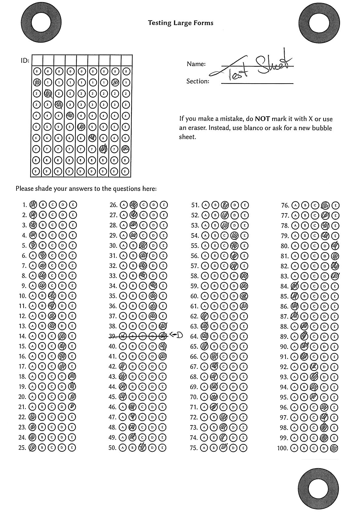

# autograder

## Automatically grade MCQ exams using optical mark recognition

`autograder` allows you to automatically grade MCQ exams. It is written in pure
rust and runs both in the command line and the modern web browsers using wasm.

## High level idea

You have a lot of bubble sheets like this:

You want them automatically graded. `autograder` will transform those bubble
sheet into image reports like this:

together with a CSV file with an entry like this:

| **Filename**                                      | **ID** | **Score** |
|---------------------------------------------------|--------|-----------|
| ...                                               | ...    | ...       |
| GRADE_BY_HAND-20120-v1-score5-DOC010725-page2.png | 20120  | 5         |
| ...                                               | ...    | ...       |

## Preparation
### Installation

`cargo run help` and `trunk serve` should work just fine. You can see a demo on
[GitHub pages](https://o-tho.github.io/autograder/). Note that all computations
are done within the browser and no sensitive files will be transmitted anywhere.

### The template

We need a template which tells us where every answer box is located on the page
and where three large round circles on the page are to identify the position of
a scan.

You have two options for this. You can either use the *Create Form* view, which
generates a PDF file to print (in A4) and the corresponding `template.json` file
that you need to provide when you grade the exam. This is the recommended way
and _very_ quick to do. If however the standard format does not work for you,
you can also provide a custom form:

#### Using a custom form

If you want to use a custom form, this is entirely possible, but significantly
more painful. _There is no need to do this step if you generate the form using
`autograder`!_

For this, go to the *Create Template* view. Upload an image file (like .png) of
an empty form, preferably directly converted from a PDF file so nothing is
skewed by a scanner. You need to enter the following information:

- how many questions there are
- how long the student ID is
- how many versions the exam has
- how many answers each question has
- how wide an answer bubble is (in px)
- how high an answer bubble is (in px)
- how much padding there is between the bubbles (in px)
- the top-left corner of the first bubble of  the first question (in px)
- the top-left corner of the first bubble of the version question (in px)
- the top-left corner of the first bubble of the first ID question
- the approximate center of the three big circles (in px)
- the approximate radius of the inner white circle (in px)

You should use an image editor like gimp to find out those coordinates.

After entering this data and uploading an image file, you can hit "Preview" to
see if everything goes well. You can then download the configuration to
`template.json`

If this does not work in your case, you will need to adapt the `template.json`
by hand and provide the coordinates of the bounding boxes of all bubbles (top
left corner and bottom right corner).

### The exam key

Go to *Create Key*. Enter how many versions you have and enter the correct
answers. You can then download the key as `key.json`

Every question is graded equally as one point. Most of the time a key will look
like this: `ABCDEABCDE`, which means the correct answer to Q1 is A, to Q2 is B
etc. However, potentially more than one answer is correct. If for example in
question 2, a student can choose either B or E, then `A(BE)CDEABCDE` would allow
for either answer in question 2.

## Grading Exams

Please scan to grayscale (and not to "black and white" or binary), because many
scanners use bad algorithms for the conversion to pure black and white. A
resolution of 150dpi works very well. You can either use multipage tiff files or
PDF. Occasionally scanners produce faulty image files. In that case `autograder`
will complain and some image reports will just include error messages.

In the *Generate Report* view you can upload a `template.json`, a `key.json` and
an image container (like a multi-page tiff, a PDF, or a single image).

Once you have uploaded them, you see a button to *Do the thing*. This might take
a moment -- and because the browser has only access to a single thread, updates
in the UI might take a while. Scans are processed in batches of 20, occasionally
triggering an update in the view. You can always look into the developer
console, which has a rather verbose output to what is happening in the background.

Afterwards you can download a zip file containing a CSV file with all the
results and conveniently named image reports. Let's discuss three example image
reports and how we should understand them:

This report is the easiest to understand. First of all, the background colour
indicates whether an answer is correct or incorrect with respect to the provided
key, so for example the correct answer to Q6 is D and all other answers are
incorrect. The foreground indicates whether `autograder` detected a student
selection, so from the bright green and bright red we see that the student
selected BCBCBCBEBD. All answers are correct except for Q6, where the student
selected C but should have selected D. This corresponds to 9 points (out of 10).

We have seen this report at the very start:

Here we also see an orange background. Here `autograder` was not completely sure
how to grade the answers. `autograder` only awards points when it is sure that
the student selected the correct answer and gives you the responsibility to deal
with ambiguous cases. Questions 1, 4, 5, 9, 10 are the questions where the
student clearly selected the correct answer. `autograder` hence gave this
student a score of five out of ten. However, you might want to override this:

In Q3 we see that the student selected two bubbles, C and D, but did not select
any bubbles in Q2. Considering that C is correct in Q2 and D is correct in Q3,
it is easy to imagine that the student accidentally moved into the wrong row
while shading the bubbles. How you deal with this is up to you. The student did
not get any point for Q2 or Q3 so far, but you might deem it necessary to change
that.

We also see that the `autograder` detected two selections in Q7, B and D. Of
these two answers, B is incorrect and D is correct. However, the student wrote
"D" next to the bubbles and it is clear that they meant to select this one.
Manually adding a point is up to your discretion.

For this bubble sheet, arguments can be made to give the student 5, 6, 7 or 8
points. `autograder` only awards points when the student clearly chose the
correct answer. Adding further points is up to your discretion.

Now consider this image report:

Here `autograder` is certain about the grading: if a bubble is significantly
more black than all the other ones, it will interpret that as the students's
choice in questions 7 and 10. However, `autograder` is unsure about the student
ID and flagged the sheet for that reason.

If you uploaded the three bubble sheets from one PDF file called
`DOC010725.pdf`, then the zip file you download from the web
interface will be called `DOC010725.zip` and contains
`DOC010725.csv`, which stores the following data:

| **Filename**                                        | **ID** | **Score** |
|-----------------------------------------------------|--------|-----------|
| 12345-v0-score9-DOC010725-page1.png                 | 12345  | 9         |
| GRADE\_BY\_HAND-20120-v1-score5-DOC010725-page2.png | 20120  | 5         |
| GRADE\_BY\_HAND-9999-v2-score3-DOC010725-page3.png  | 9999   | 3         |

The zip file also contains those image files, which make it easy to see which
files need manual attention. The suffix "pageN" indicated the page in the
original file `DOC010725.pdf` if you want to look at the image
before `autograder`'s processing.

### Using autograder from a mobile device

If you only want to use `autograder` to grade a handful of bubble sheets, you can
do it like this:

First, on a device with a large display, navigate to *Create Magic Link*. Here
you can upload a key and a template and `autograder` generates a _very_ long link.
This link encodes all the template and key data and can be shared with anyone --
most importantly yourself for usage on a mobile device. Bookmark that
very long link with a descriptive name like "Stat101 Test 1" on your mobile device.

If you open the magic link on a mobile device, you will see (if the width of
your screen is less than its height) a simplified interface, where you can
upload individual pictures from your mobile device for instant grading.

Please make sure that the image only shows the (complete) bubble sheet by
cropping.

## History

We have previously used
[FormScanner](https://sites.google.com/site/examgrader/formscanner), but
encountered issues in our use cases: Java tends to be a pain to set up, using
Excel to grade the exams wasn't convenient for us and it was very difficult to
check for mistakes in the individual grading.

As this is work in progress, we chose to be compatible with bubble sheets as
used by form scanner.

## Acknowledgements

This project uses [typst](https://github.com/typst/typst) for typesetting and
ships with copies of the Linux Biolinum font by Philipp H Poll.
